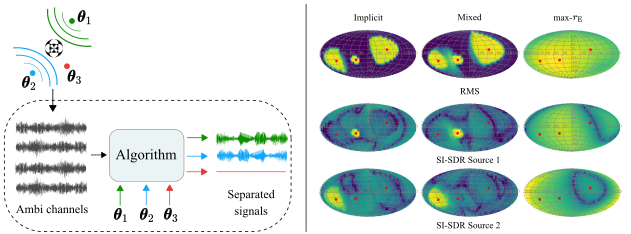

Direction Specific Ambisonics Source Separation with End-To-End Deep Learning
====

Deep learning for directional sound source separation from Ambisonics mixtures.

## About

This respository contains code accompanying the paper "Direction Specific Ambisonics Source Separation with End-To-End Deep Learning".

## Setup
For installation instructions, please see [Install.md](Install.md).

## Data Generation
1. Download the [musdb18hq](https://sigsep.github.io/datasets/musdb.html#musdb18-hq-uncompressed-wav) and the [FUSS](https://github.com/google-research/sound-separation/blob/master/datasets/fuss/FUSS_license_doc/README.md) datasets.
2. Specify the root path of each dataset in `mix.py` (inside `prepareMUSDB()` and  `prepareFuss()` functions).
3. Generate data by runninng:
    `python mix.py [train/validate/test] [num_mixes] [num_mixes_with_silent_sources] [minimal_angular_dist] [save_path] [optionals]`   
Example (Musdb18 train set with room): `python mix.py train 10000 3000 5 /path/to/save/data --dataset musdb --render_room --room_size_range 2 2 1 --rt_range 0.2`  
Example (FUSS train set with room): `python mix.py train 20000 0 5 /path/to/save/data --dataset fuss --render_room --room_size_range 2 2 1 --rt_range 0.2`   
4. A detailed description of all configurable arguments can be found in `mix.py`.

## Usage

#### Training:
Example (Implicit mode, order 1): `python train.py /path/train_dir/ /path/validate_dir/ --name o1_implicit --ambiorder 1 --ambimode implicit --checkpoints_dir ./checkpoints --batch_size 16 --use_cuda`  
Example (Mixed mode, order 4): `python train.py /path/train_dir/ /path/validate_dir/ --name o4_mixed --ambiorder 4 --ambimode mixed --checkpoints_dir ./checkpoints --batch_size 16 --use_cuda`

A detailed description of all configurable parameters can be found in `train.py`

#### Source Separation Evaluation:
Example (Implicit mode, order 2): `python evaluate_music_separation.py /path/test_dir/ /checkpoint/file.pt --use_cuda --ambiorder 2 --ambimode implicit --result_dir /path/result_dir/`  
A detailed description of all configurable parameters can be found in `evaluate_music_separation.py`

## Acknowlegements

We reuse code from Cone-of-Silence (https://github.com/vivjay30/Cone-of-Silence).  
This project has received funding from the European Union's Horizon 2020 research and innovation programme under the Marie Sklodowska-Curie grant agreement No 812719. 

